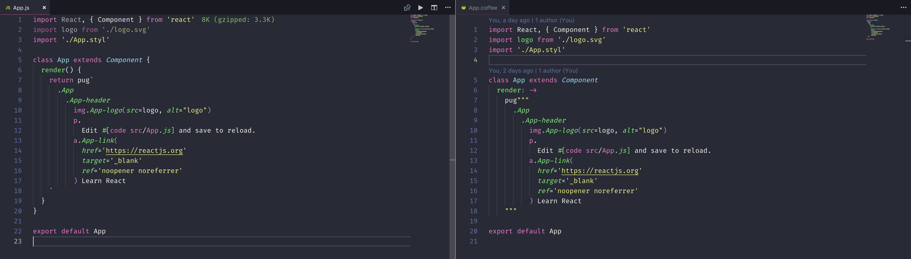

> Forked from (vscode-react-pug)[https://github.com/kaminaly/vscode-react-pug] by kaminaly to add coffee-pug support
> Many thanks to kaminaly!

# vscode-react-coffee-pug

Syntax highlighting for pug in react written in js, jsx, ts, tsx and **coffee**.

Following babel plug in is used to write pug directly inside react code.

[(babel-plugin-transform-react-pug)](https://github.com/pugjs/babel-plugin-transform-react-pug)

## Install

Inside VSCode, press `Ctrl+P`, and enter:

```
ext install vscode-react-coffee-pug
```

Please see below screen shot

